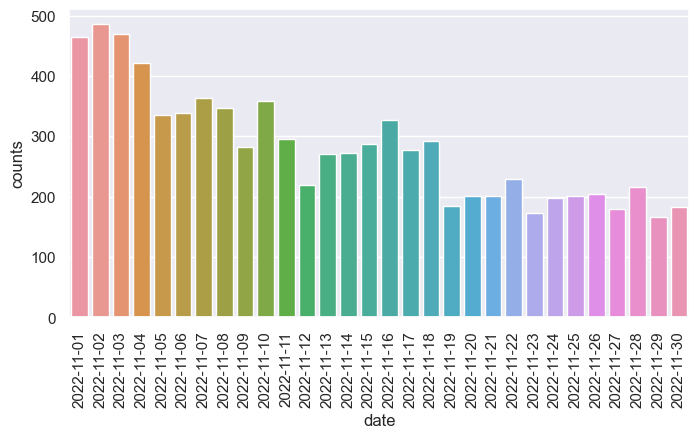

# 30DayMapChallenge-Bot

Monitoring [#30DayMapChallenge 2022](https://30daymapchallenge.com) launched by [Topi Tjukanov](https://twitter.com/tjukanov) on Twitter. Trying to engage this wonderful event in a special way.

(image adapted from Topi Tjukanov's)

## Twitter Data

#30DayMapChallenge related tweets are collected via Twitter REST API with the hashtag `#30DayMapChallenge`. The example of raw .json data returned via Twitter REST API can be found in `.\example` folder. This repo only select serveral attributes from tweet metadata including: `tweet_id`, `tweet_text`, `language`, `tweet_created_at`, `retweet`, `favorite`, `hashtags`, `user_id`, `user_name`, `user`, `user_loc`, `user_follower`, `friends_count`, `media` and save as .csv file in `.\data` folder.

Note:

- `#30DayMapChallenge` with image attached
- search tweets by date since everyday has diffferent map theme
- cleanning process for late entry tweets is only conducted in first two days
- some tweets in certain time zones (such as Pacific Time) might be searched and archived in file next day

## Daily Tweets Statistics

## Top Favourited/:heart: Maps

As [Topi Tjukanov](https://twitter.com/tjukanov) mentioned in [30DayMapChallenge](https://github.com/tjukanovt/30DayMapChallenge) page, this map challenge is NOT a competition. Although this repo sorts maps by their favorite count and retweet count, this repo never intend to compare all the wonderful maps but create a altas of inspiring maps.

Top favorited tweets refers to the tweets get many `liked`/:heart:. The faviorite count is extracted from `favorite_count` value in tweet metadata.

|                                                                                     |                                                     |                                                                                     |                                   December 2021                                    |                                                         |                                                               |                                                                                                   |
| :---------------------------------------------------------------------------------: | :-------------------------------------------------: | :---------------------------------------------------------------------------------: | :--------------------------------------------------------------------------------: | :-----------------------------------------------------: | :-----------------------------------------------------------: | :-----------------------------------------------------------------------------------------------: |
|                                       **Mon**                                       |                       **Tue**                       |                                       **Wed**                                       |                                      **Thu**                                       |                         **Fri**                         |                            **Sat**                            |                                              **Sun**                                              |
|                   **1**  **[Points](daily/day01_Points.md)**                    |    **2**  **[Lines](daily/day02_Lines.md)**     |                 **3**  **[Polygons](daily/day03_Polygons.md)**                  |     **4**  **[Colour Friday: Green](daily/day04_Colour_Friday-Green.md)**      |       **5**  **[Ukraine](daily/Ukraine.md)**        |       **6**  **[Network](daily/day06_Network.md)**        |                          **7**  **[Raster](daily/day07_Raster.md)**                           |
|       **8**  **[Data: OpenStreetMap](daily/day08_Data-OpenStreetMap.md)**       |    **9**  **[Space](daily/day09_Space.md)**     |                **10**  **[A bad map](daily/day10_A_bad_map.md)**                |       **11**  **[Colour Friday: Red](daily/day11_Colour_Friday-Red.md)**       |   **12**  **[Population](daily/day12_Scale.md)**    |  **13**  **[5 minute map](daily/day13_5_minute_map.md)**  |                        **14**  **[Hexagons](daily/day14_Hexagons.md)**                        |
|               **15**  **[Food/drink](daily/day15_Food/drink.md)**               |  **16**  **[Minimal](daily/day16_Minimal.md)**  | **17**  **[A map without a computer](daily/day17_A_map_without_a_computer.md)** |      **18**  **[Colour Friday: Blue](daily/day18_Colour_Friday-Blue.md)**      |      **19**  **[Globe](daily/day19_Globe.md)**      | **20**   **[My favourite…](daily/day20_My_favourite.md)** | **21**   **[Data: Kontur Population Dataset](daily/day21_Data-Kontur_Population_Dataset.md)** |
|                     **22**  **[NULL](daily/day22_NULL.md)**                     | **23**  **[Movement](daily/day23_Movement.md)** |                  **24**  **[Fantasy](daily/day24_Fantasy.md)**                  | **25**  **[Colour Friday: 2 colours](daily/day25_Colour_Friday-2_colours.md)** | **26**  **[Island(s)](<daily/day26_Island(s).md>)** |         **27**  **[Music](daily/day27_Music.md)**         |                              **28**  **[3D](daily/day28_3D.md)**                              |
| **29**  **[NUOut of my comfort zoneLL](daily/day29_Out_of_my_comfort_zone.md)** |   **30**   **[Remix](daily/day30_Remix.md)**    |                                                                                     |                                                                                    |                                                         |                                                               |                                                                                                   |

## Users Langauge

Tweets with `#30DayMapChallenge` hashtag from 2022-11-01 to 2022-11-30 are in **33** languages (Twitter account setting) including `es`, `en`, `fr`, `ja`, `lv`, `it`, `nl`, `cy`, `in`, `und`, `ca`, `qme`, `de`, `fi`, `et`, `cs`, `lt`, `uk`, `da`, `ro`, `pt`, `ar`, `iw`, `tl`, `ht`, `pl`, `tr`, `eu`, `sl`, `zh`, `sv`, `ru`, `no`.

## Users Location

By geocoding users location in their profile, I plot the map of distribution of users who involves in this event. Geocoding process is conducted via https://geocode.localfocus.nl/

## Map Wall (to do)

The map wall includes 95\*95 maps from the 9036 images attached in #30DayMapChallenge tweets. The map walls with different background can be found in `.\static` folder. Since the maps were automatically collected from media url in tweets' metadata, you may find a few 'noise' or duplicate images.

<!--  -->

## #30DayMapChallenge stats in last year

**[#30DayMapChallenge 2020](archive/2020/)** \
**[#30DayMapChallenge 2021](archive/2021/)**

<!-- Inspiration for the repo came from [Kalle Hallden](https://www.youtube.com/channel/UCWr0mx597DnSGLFk1WfvSkQ). -->
