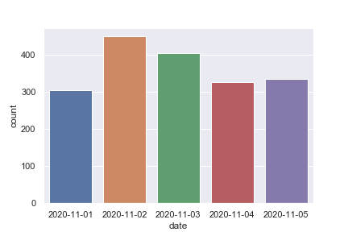

## 30DayMapChallenge-Bot
Monitoring [#30DayMapChallenge 2020](https://github.com/tjukanovt/30DayMapChallenge) launched by [Topi Tjukanov](https://twitter.com/tjukanov) on Twitter. Trying to engage this wonderful event in a special way. 

### Data
#30DayMapChallenge related tweets are collected via Twitter REST API with the hashtag `#30DayMapChallenge`. All tweets are saved in `.\data` folder.
-  `#30DayMapChallenge` with image attached
- search tweets by date since everyday has diffferent map theme
- cleanning process for late entry tweets is only conducted in first two days

### Summary
(Bar plot of daily tweets count for `#30DayMapChallenge 2020` now has been updated. Previous version wrongly count duplicate files in data folder.)

### Maps

As [Topi Tjukanov](https://twitter.com/tjukanov) mentioned in [30DayMapChallenge](https://github.com/tjukanovt/30DayMapChallenge) page, this map challenge is NOT a competation. Although this repo sorts maps by their favoriate count and retweet count. This repo never intend to compare all the wonderful maps but create a altas of inspiring maps for a reference. I am also interested in exploring topis in replies in those maps with more attention (if i have time).

- **[Maps for Day 1 `#30DayMapChallenge (Points)`](day1.md)** (include late entry)

- **[Maps for Day 2 `#30DayMapChallenge (Lines)`](day2.md)** (exclude late entry)

- **[Maps for Day 3 `#30DayMapChallenge (Polygons)`](day3.md)**

- **[Maps for Day 4 `#30DayMapChallenge (Hexagons)`](day4.md)**

- **[Maps for Day 5 `#30DayMapChallenge (Blue)`](day05_Blue.md)**

- **[Maps for Day 6 `#30DayMapChallenge (Red)`](day06_Red.md)**

- **[Maps for Day 7 `#30DayMapChallenge (Green)`](day07_Green.md)**

- **[Maps for Day 8 `#30DayMapChallenge (Yellow)`](day08_Yellow.md)**

- **[Maps for Day 9 `#30DayMapChallenge (Monochrome)`](day09_Monochrome.md)**

- **[Maps for Day 10 `#30DayMapChallenge (Grid)`](day10_Grid.md)**

- **[Maps for Day 11 `#30DayMapChallenge (3D)`](day11_3D.md)**

- **[Maps for Day 12 `#30DayMapChallenge (Map not made with GIS software)`](day12_Map%20not%20made%20with%20GIS%20software.md)**

- **[Maps for Day 13 `#30DayMapChallenge (Raster)`](day13_Raster.md)**

#### Top favorited post for day 13 `#30DayMapChallenge (Raster)`
| user                                           |   retweet |   favorite | media                                                           |
|------------------------------------------------|-----------|------------|-----------------------------------------------------------------|
| **[@Helenmckmck](https://t.co/X4SzSipFnn)**    |        28 |        253 |              |
| **[@martgnz](https://t.co/4Sph9egEfg)**        |        47 |        225 |              |
| **[@rajbhagatt](https://t.co/4GItIXM19M)**     |        24 |        148 |              |
| **[@tjukanov](https://t.co/gsrAi6Tlbb)**       |         4 |         68 |              |
| **[@JaneSunflower](https://t.co/7lad0b5zIi)**  |        13 |         64 |              |
| **[@JPeterPeters](https://t.co/IbGgXcvlKd)**   |         8 |         63 |              |
| **[@daniel_isita](https://t.co/CpHaaoCZr8)**   |         2 |         40 |              |
| **[@neocartocnrs](https://t.co/syYUTunN4Y)**   |         7 |         38 |              |
| **[@pokateo_](https://t.co/bhkCPF5piz)**       |         3 |         37 |              |
| **[@EFisherWX](https://t.co/8YwQWlx8yL)**      |         6 |         37 |  |
| **[@g_fiske](https://t.co/2smvV1FfaY)**        |         5 |         36 |              |
| **[@gontsa](https://t.co/DosI3yRezh)**         |         5 |         32 |              |
 

Inspiration for the repo came from [Kalle Hallden](https://www.youtube.com/channel/UCWr0mx597DnSGLFk1WfvSkQ).