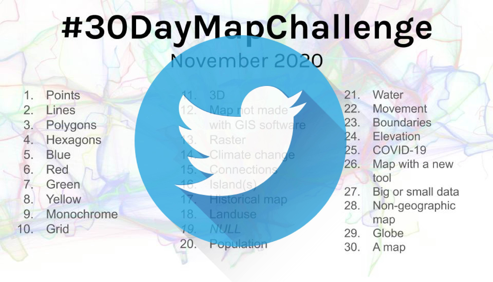

## 30DayMapChallenge-Bot
Monitoring [#30DayMapChallenge 2020](https://github.com/tjukanovt/30DayMapChallenge) launched by [Topi Tjukanov](https://twitter.com/tjukanov) on Twitter. Trying to engage this wonderful event in a special way. 

### Twitter Data
#30DayMapChallenge related tweets are collected via Twitter REST API with the hashtag `#30DayMapChallenge`. The example of raw .json data returned via Twitter REST API can be found in `.\example` folder. This repo only select serveral attributes from tweet metadata including: `tweet_id`, `tweet_text`, `language`, `tweet_created_at`, `retweet`, `favorite`, `hashtags`, `user_id`, `user_name`, `user`, `user_loc`, `user_follower`, `friends_count`, `media` and save as .csv file in `.\data` folder.

Note:
-  `#30DayMapChallenge` with image attached
- search tweets by date since everyday has diffferent map theme
- cleanning process for late entry tweets is only conducted in first two days
- some tweets in certain time zones (such as Pacific Time) might be searched and archived in file next day

### Daily Tweets Statistics
(Bar plot of daily tweets count for `#30DayMapChallenge 2020` now has been updated. Previous version wrongly count duplicate files in data folder.)

### Top Favourited/:heart: Maps

As [Topi Tjukanov](https://twitter.com/tjukanov) mentioned in [30DayMapChallenge](https://github.com/tjukanovt/30DayMapChallenge) page, this map challenge is NOT a competation. Although this repo sorts maps by their favorite count and retweet count, this repo never intend to compare all the wonderful maps but create a altas of inspiring maps for a reference. I am also interested in exploring topis in replies in those maps with more attention (if i have time).

Top favorited tweets refers to the tweets get many `liked`/:heart:. The faviorite count is extracted from `favorite_count` value in tweet metadata.

| |||December 2020||| |
|:---:|:---:|:---:|:---:|:---:|:---:|:---:|
| **Mon** | **Tue** | **Wed** | **Thu** | **Fri** | **Sat** | **Sun** |
|     |     |     |     |     |     | **1**  **[Points](day1.md)**|
| **2**  **[Lines](day2.md)**   |**3**  **[Polygons](day3.md)**   |**4**  **[Hexagons](day4.md)**    | **5**  **[Blue](day05_Blue.md)**   | **6**  **[Red](day06_Red.md)**   | **7**  **[Green](day07_Green.md)**  | **8**  **[Yellow](day08_Yellow.md)**  |
| **9**  **[Monochrome](day09_Monochrome.md)** | **10**  **[Grid](day10_Grid.md)**  | **11**  **[3D](day11_3D.md)**  | **12**  **[No GIS](day12_Map%20not%20made%20with%20GIS%20software.md)**  | **13**  **[Raster](day13_Raster.md)**  | **14**  **[Climate change](day14_Climate%20change.md)**  |  **15**  **[Connections](day15_Connections.md)**  |
|  **16**  **[Island(s)](day16_Island(s).md)**  |   **17**  **[Historical map](day17_Historical%20map.md)**   |  **18**  **[Landuse](day18_Landuse.md)**    |   **19**  **[NULL](day19_NULL.md)**   |   **20**   **[Population](day20_Population.md)**  |   **21**   **[Water](day21_Water.md)**  |  **22**  **[Movement](day22_Movement.md)**    |
|   **23**  **[Boundaries](day23_Boundaries.md)**   |   **24**  **[Elevation](day24_Elevation.md)**   |   **25**  **[COVID-19](day25_COVID-19.md)**   |   **26**  **[Map with a new tool](day26_Map%20with%20a%20new%20tool.md)**   |   **27**  **[Big or small data](day27_Big%20or%20small%20data.md)**   |   **28**  **[Non-geographic map](day28_Non-geographic%20map.md)**   |  **29**  **[Globe](day29_Globe.md)**    |
|  **30**      |     |     |     |     |     |     |

<!-- - **[Maps for Day 1 `#30DayMapChallenge (Points)`](day1.md)** (include late entry)

- **[Maps for Day 2 `#30DayMapChallenge (Lines)`](day2.md)** (exclude late entry)

- **[Maps for Day 3 `#30DayMapChallenge (Polygons)`](day3.md)**

- **[Maps for Day 4 `#30DayMapChallenge (Hexagons)`](day4.md)**

- **[Maps for Day 5 `#30DayMapChallenge (Blue)`](day05_Blue.md)**

- **[Maps for Day 6 `#30DayMapChallenge (Red)`](day06_Red.md)**

- **[Maps for Day 7 `#30DayMapChallenge (Green)`](day07_Green.md)**

- **[Maps for Day 8 `#30DayMapChallenge (Yellow)`](day08_Yellow.md)**

- **[Maps for Day 9 `#30DayMapChallenge (Monochrome)`](day09_Monochrome.md)**

- **[Maps for Day 10 `#30DayMapChallenge (Grid)`](day10_Grid.md)**

- **[Maps for Day 11 `#30DayMapChallenge (3D)`](day11_3D.md)**

- **[Maps for Day 12 `#30DayMapChallenge (Map not made with GIS software)`](day12_Map%20not%20made%20with%20GIS%20software.md)**

- **[Maps for Day 13 `#30DayMapChallenge (Raster)`](day13_Raster.md)**

- **[Maps for Day 14 `#30DayMapChallenge (Climate change)`](day14_Climate%20change.md)**

- **[Maps for Day 15 `#30DayMapChallenge (Connections)`](day15_Connections.md)**
 -->

#### Top favorited post for day 29 `#30DayMapChallenge (Globe)`
| media                                                                                        | user                                                                             |   retweet |   favorite |
|----------------------------------------------------------------------------------------------|----------------------------------------------------------------------------------|-----------|------------|
|  | **[@dataisawesomeo](https://twitter.com/twitter/statuses/1332995325766864896)**  |        17 |        209 |
|                                           | **[@tjukanov](https://twitter.com/twitter/statuses/1332983790302588928)**        |        12 |        182 |
|  | **[@neocartocnrs](https://twitter.com/twitter/statuses/1332961439703773184)**    |        31 |        180 |
|                                           | **[@spatialoccasio1](https://twitter.com/twitter/statuses/1333094311626469377)** |        15 |        140 |
|                                           | **[@ilyankou](https://twitter.com/twitter/statuses/1333093871409115138)**        |         8 |        117 |
|  | **[@stevefaeembra](https://twitter.com/twitter/statuses/1333089563879890946)**   |        17 |        101 |
|  | **[@owenjpowell](https://twitter.com/twitter/statuses/1332986529812275200)**     |        11 |         99 |
|  | **[@rajbhagatt](https://twitter.com/twitter/statuses/1333093104576987136)**      |        12 |         90 |
|                               | **[@juanluistv_](https://twitter.com/twitter/statuses/1332952602380787719)**     |         9 |         77 |
|                               | **[@Neil_py_harris](https://twitter.com/twitter/statuses/1332981469128560640)**  |         4 |         63 |
|                               | **[@lacxrx](https://twitter.com/twitter/statuses/1332949716708057090)**          |        10 |         62 |
|                                           | **[@helenmakesmaps](https://twitter.com/twitter/statuses/1333057846007767043)**  |        13 |         58 |
|                                           | **[@balt_ti](https://twitter.com/twitter/statuses/1333000268288577538)**         |         7 |         56 |
|                                           | **[@hurricanevicky](https://twitter.com/twitter/statuses/1332866450529382400)**  |         2 |         55 |
|                                           | **[@klaskarlsson](https://twitter.com/twitter/statuses/1332994449715105793)**    |         4 |         53 |
 

Inspiration for the repo came from [Kalle Hallden](https://www.youtube.com/channel/UCWr0mx597DnSGLFk1WfvSkQ).