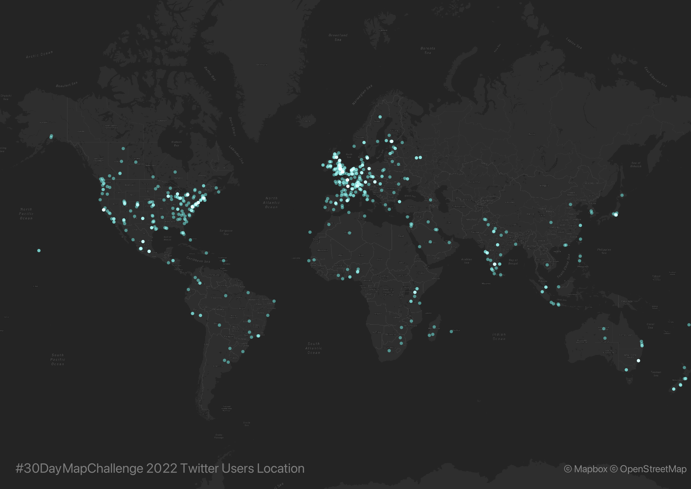

## 30DayMapChallenge-Bot
Monitoring [#30DayMapChallenge 2020](https://github.com/tjukanovt/30DayMapChallenge) launched by [Topi Tjukanov](https://twitter.com/tjukanov) on Twitter. Trying to engage this wonderful event in a special way. 

### Twitter Data
#30DayMapChallenge related tweets are collected via Twitter REST API with the hashtag `#30DayMapChallenge`. The example of raw .json data returned via Twitter REST API can be found in `.\example` folder. This repo only select serveral attributes from tweet metadata including: `tweet_id`, `tweet_text`, `language`, `tweet_created_at`, `retweet`, `favorite`, `hashtags`, `user_id`, `user_name`, `user`, `user_loc`, `user_follower`, `friends_count`, `media` and save as .csv file in `.\data` folder.

Note:
-  `#30DayMapChallenge` with image attached
- search tweets by date since everyday has diffferent map theme
- cleanning process for late entry tweets is only conducted in first two days
- some tweets in certain time zones (such as Pacific Time) might be searched and archived in file next day

### Daily Tweets Statistics

### Top Favourited/:heart: Maps

As [Topi Tjukanov](https://twitter.com/tjukanov) mentioned in [30DayMapChallenge](https://github.com/tjukanovt/30DayMapChallenge) page, this map challenge is NOT a competation. Although this repo sorts maps by their favorite count and retweet count, this repo never intend to compare all the wonderful maps but create a altas of inspiring maps for a reference. I am also interested in exploring topis in replies in those maps with more attention (if i have time).

Top favorited tweets refers to the tweets get many `liked`/:heart:. The faviorite count is extracted from `favorite_count` value in tweet metadata. 

| |||December 2021||| |
|:---:|:---:|:---:|:---:|:---:|:---:|:---:|
| **Mon** | **Tue** | **Wed** | **Thu** | **Fri** | **Sat** | **Sun** |
| **1**  **[Points](daily/day01_Points.md)**| **2**  **[Lines](daily/day02_Lines.md)**   |**3**  **[Polygons](daily/day03.md)**   |**4**  **[Hexagons](daily/day04_Hexagons.md)**    | **5**  **[Data challenge 1: OpenStreetMap](daily/day05_Data%20challenge%201.md)**   | **6**  **[Red](daily/day06_Red.md)**   | **7**  **[Green](daily/day07_Green.md)**  |
| **8**  **[Blue](daily/day08_Blue.md)**  | **9**  **[Monochrome](daily/day09_Monochrome.md)** | **10**  **[Raster](daily/day10_Raster.md)**  | **11**  **[3D](daily/day11_3D.md)**  | **12**  **[Population](daily/day12_Population.md)**  | **13**  **[Data challenge 2: Natural Earth](daily/day13_Data%20challenge%202.md)**  | **14**  **[Map with a new tool](daily/day14_Map with a new tool.md)**  |
|  **15**  **[Map made without using a computer](daily/day15_Map%20made%20without%20using%20a%20computer.md)**  |  **16**  **[Urban/rural](daily/day16_Urban&rural.md)**  |   **17**  **[Land](daily/day17_Land.md)**   |  **18**  **[Water](daily/day18_Water.md)**    |   **19**  **[Island(s)](daily/day19_Island(s).md)**   |   **20**   **[Movement](daily/day20_Movement.md)**  |   **21**   **[Elevation](daily/day21_Elevation.md)**  |  **22**  **[Boundaries](daily/day22_Boundaries.md)**    |
|   **23**  **[Data challenge 3: GHSL Global Human Settlement Layer](daily/day23_Data%20challenge%203.md)**   |   **24**  **[Historical map](daily/day24_Historical%20map.md)**   |   **25**  **[Interactive map](daily/day25_Interactive%20map.md)**   |   **26**  **[Choropleth map](daily/day26_Choropleth%20map)**   |   **27**  **[Heatmap](daily/day27_Heatmap.md)**   |   **28**  **[The Earth is not flat](daily/day28_The%20Earth%20is%20not%20flat.md)**   |  
| **29**  **[NULL](daily/day29_NULL.md)**    |  **30**   **[Metamapping day](daily/day30_Metamapping%20day.md)**   |     |     |     |     |     | 

<!-- ### Users Langauge

Tweets with `#30DayMapChallenge` hashtag from 2020-11-01 to 2020-12-02 are in **32** languages (Twitter account setting) including `es`, `en`, `fr`, `und`, `de`, `ru`, `lt`, `lv`, `no`, `tr`, `in`, `nl`, `pt`, `ja`, `et`, `ro`, `ca`, `ht`, `tl`, `pl`, `sv`, `da`, `it`, `bg`, `fi`, `eu`, `ar`, `vi`, `cy`, `ko`, `is`, `uk`.

### Users Location
By geocoding users location in their profile, I plot the map of distribution of users who involvs in this event. Geocoding process is conducted via https://geocode.localfocus.nl/

 -->

<!-- ### Map Wall

The grid graph (87*87) includes 7569 maps. The seperated maps(resized) can be found in `.\mapwall` folder. Since the maps were automatically collected from media url in tweets' metadata, you may find a few 'noise' or duplicate images.

Inspiration for the repo came from [Kalle Hallden](https://www.youtube.com/channel/UCWr0mx597DnSGLFk1WfvSkQ). -->